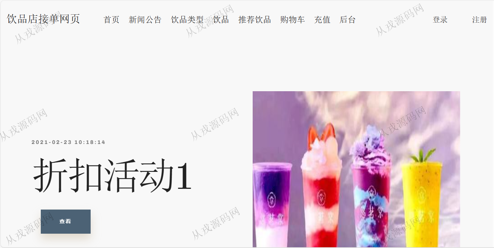
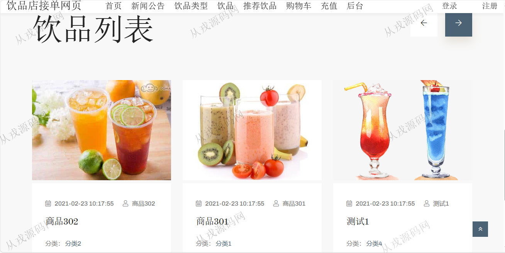
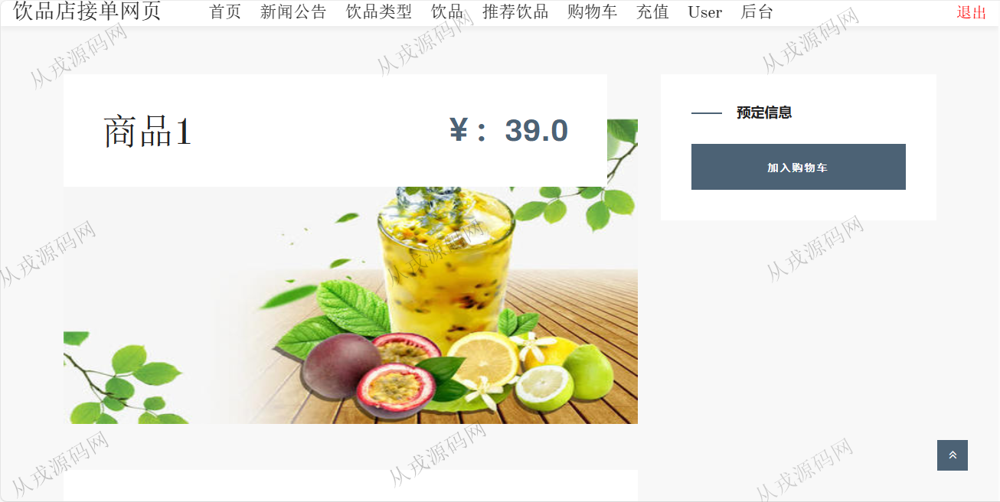
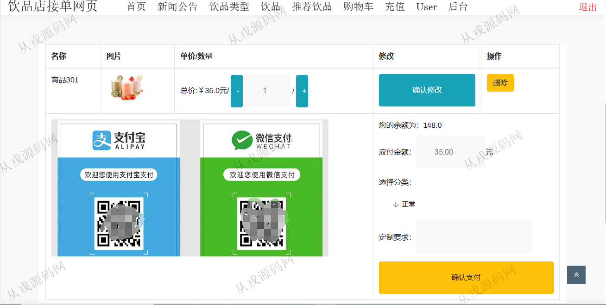
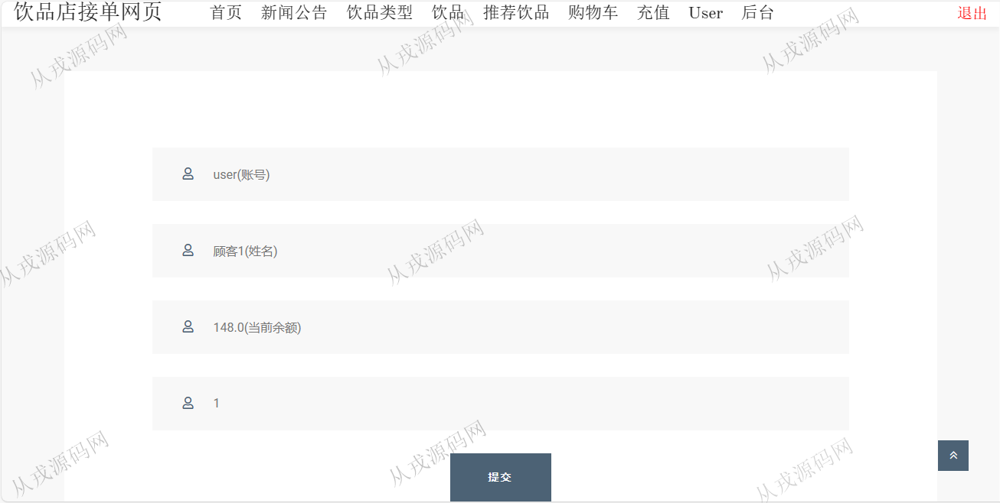
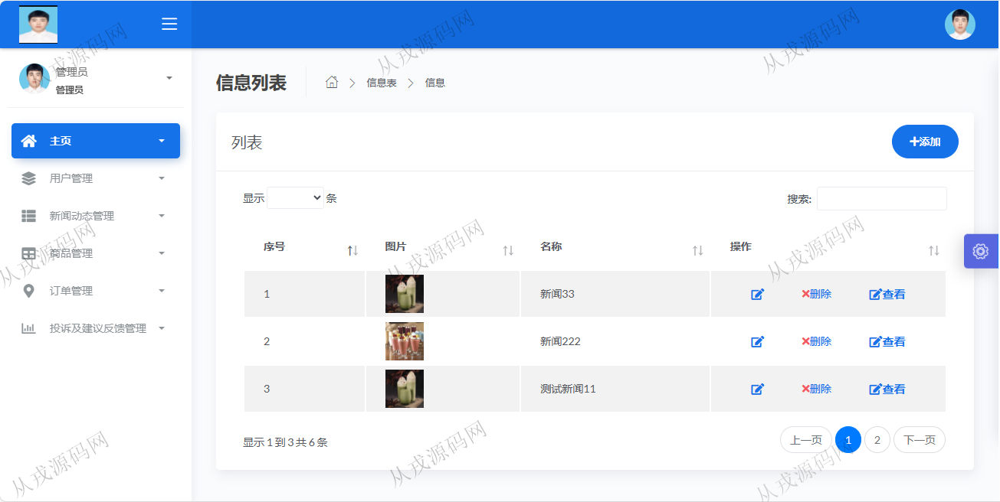
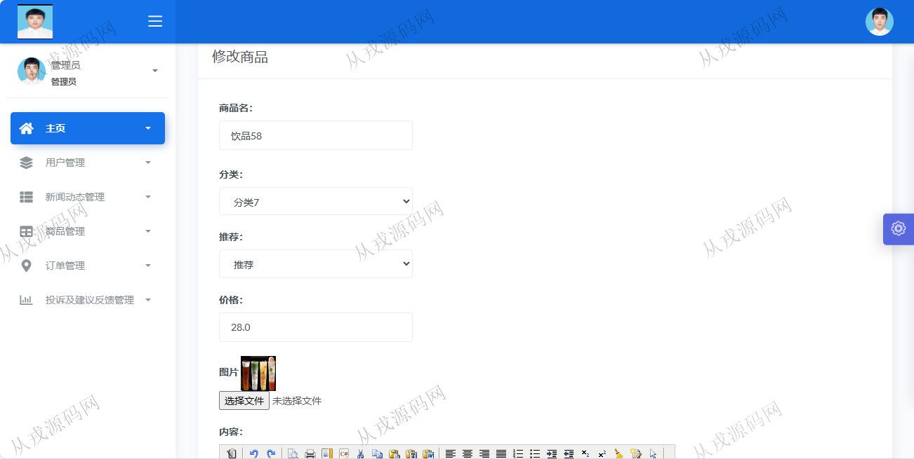
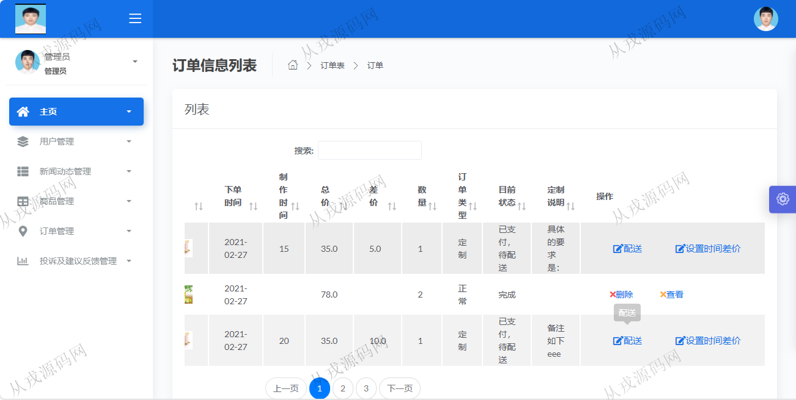

<h1 align="center">86.饮品店接单网页管理系统</h1>

 获取sql文件 QQ: 386869957 QQ群: 377586148 

 [推荐站点: 从戎源码网](https://armycodes.com/) 

## 简介

> 本代码来源于网络,仅供学习参考使用!
>
> 提供1.远程部署/2.修改代码/3.设计文档指导/4.框架代码讲解等服务
> 
> 前台访问地址：http://localhost:8080/
> 
> 顾客登录地址：http://localhost:8080/login.jsp
> 
> 顾客：user 123456
> 
> 管理后台登录地址: http://localhost:8080/admin/login.jsp
> 
> 管理员：admin 123456
> 
> 员工：yg01 123456
>

## 项目介绍
基于ssm的饮品店接单网页管理系统：前端 jsp、jquery、bootstrap，后端 springmvc、spring、mybatis，角色分为管理员、员工、顾客；集成商品管理、新闻动态、饮品购买，购物车，在线付款等功能于一体的系统。

## 功能介绍

### 用户

- 基本功能：登录，注册，退出
- 网站首页：导航栏，轮播图，饮品列表，饮品类型导航
- 饮品购买：饮品详情，加入购物车，购物车确认支付，用户充值

### 管理员

- 用户管理：顾客信息的增删改查，员工信息的增删改查，个人信息修改，密码修改
- 新闻动态管理：新闻信息的增删改查
- 商品类型管理：商品类型信息的增删改查，商品信息的增删改查，图片上传，富文本编辑
- 订单管理：订单信息列表查询，查看详情，删除，配送，设置时间差价
- 投诉建议管理：投诉信息列表查询，删除，回复

### 员工

- 用户管理：顾客信息的增删改查，个人信息修改，密码修改
- 新闻动态管理：新闻信息的增删改查
- 商品管理：商品信息的增删改查，图片上传，富文本编辑

## 环境

- <b>IntelliJ IDEA 2021.3</b>

- <b>Mysql 5.7.26</b>

- <b>Maven</b>

- <b>JDK 1.8</b>

## 运行截图

